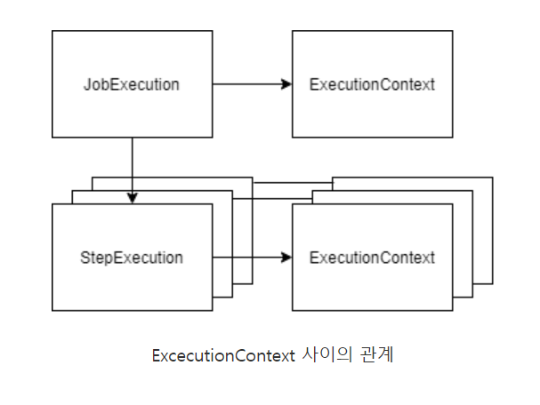

# spring-batch-practise

## 4장
1. Annotation
#### EnableBatchProcessing : 
1) 이 이노테이션은 배치 인프라스트럭쳐를 부스트스랩하는데 사용된다. 따라서, 다음과 같은 컴포넌트를 직접 포함시킬 필요는 없다.
2) 또한, 애플리케이션 내에서 한번만 적용이 된다.
2. class
#### JobBuilderFactory
1) get() 메소드를 호출시, 잡 이름을 전달하며 JobBuilder를 얻을 수 있다. 이 빌더를 사용해 잡을 구성할수 있다.
#### StepBuilderFactory
1) 예제에서 사용하는 스텝은 태스크릿을 사용하므로 Tasklet 구현체로써 람다 코드를 전달한다.

## 잡 파라미터
#### JobInstance
1) 잡 이름 및 잡에 전달된 식별파라미터로 식별된다.
2) 또한, 동일한 식별 파라미터로 동일한 잡을 두 번 이상 실행 할수 없다.
3) 다시 실행한다면, org.springframework.batch.core.launch.JobInstanceAlreadyCompleteException을 전달받는다.
4) 그러므로, 다시 실행하기 위해서는 파라미터를 변경해야 한다.

## Spring Batch가 잡에 파라미터를 전달하는 과정
#### JobRunner
1) 기능 중 하나는, 잡 실행에 필요한 org.springframework.batch.core.jobparameter객체를 생성해서 JobInstance에 전달하는 것이다.
* 스케쥴러를 이용하는 방법, 커맨드라인을 이용하는 방법 다 다르지만, JobLauncherCommandLineRunner를 기준으로 설명한다.
2) ex) java -jar demo.jar name=babo
3) 스프링 배치는 JobParameters라는 인스턴스를 생성하는데 이는 잡이 전달받는 모든 파라미터의 컨테이너 역할을 수행한다.

#### 식별 파라미터
1) BATCH_JOB_EXECUTION_PARAMS 테이블에는 IDENTIFYING이라는 컬럼이 존재하고, 이를 식별 파라미터로 활용할지 여부를 결정할수 있다.
2) 식별 파라미터로 사용하지 않으려면 접두사 "-"를 활용한다. ex) -name=Michael

#### 잡 파라미터에 접근하기
1) ChunkContext : tasklet은 두개의 파라미터를 전달받는다.
* org.springframework.batch.core.StepContribution : 아직 커밋되지 않은 현재 트랜잭션에 대한 정보(쓰기 수, 읽기 수 등)를 가지고 있다.
* ChunkContext : 실행 시점의 잡 상태를 제공한다. JobParameters가 포함된 org.springframework.batch.core.scope.context.StepContext참조도 존재한다.
2) Late binding : 부트스크랩시에 바인딩해주는 것이 좋다. 왜냐하면, JobParameter는 변경할수 없기 때문이다.

#### annotation
1) StepScope : @Bean Annotation과 함께 쓰이며, 이는 스텝의 실행범위나 잡의 실행범위로 들어갈때까지 빈의 생성을 지연시키는 것이다. 이렇게 함으로써, 늦은 바인딩 기능을 활용할수 있다.

#### 잡 파라미터 유효성 검증하기.
1) DefaultJobParameterValidator : fileName이 필수키이다.
2) CompositeJobParameterValidator : 두개의 유효성 검증기를 사용할수 있게 해준다.
3) org.springframework.batch.core.launch.support.RunIdIncrementer : 파라미터 run.id를 세팅해서, 하나씩 증가시키며 동일한 파라미터를 계속 실행할수 있게 해준다.
4) JobParametersIncrementer : 매일 날짜를 이용해서 해야 하는경우면, 해당 인크리멘트를 상속해서 TimeStamp형식으로 날짜를 찍어내서 실행한다. - 즉, 자동화의 개념이다.

#### 잡 리스너.
1) 잡의 실행주기에 맞춰 잡이 끝났을 경우와 시작할경우에 뭔가의 조치를 취하기 위해서 하는 리스너이다.
2) 전달받은 파라미터 변수로는 JobExecution을 전달받는다.
3) Spring은 Annotation기반으로 모든일을 처리할수 있게끔 변화하고 있다. 따라서, 특정 Annotation을 덧붙인 후, FactoryBean에 넣어준다면 특정 리스너를 랩핑해서 잡에 넣어줄것이다.

#### Execution Context
[
1) Execution Context 가져오기 : 위에서 볼수 있듯이, Execution Contex]()t는 JobExecution이나 StepExecution의 일부이다.
2) ExecutionContextPromotionListener를 통해 StepExecution안에 있는 파라미터를 JobExecution안의 파라미터로 복사를해 승격시킬수 있다.

#### Step 알아보기
1) 잡이 전체적인 처리를 담당한다면, 스텝은 잡의 구성 요소를 담당한다. 스텝은 독립적이고 순차적으로 배치 처리를 수행한다.

* 원리 : 왜 뭔가의 Interface를 상속받고, 특정 메소드를 구현하면 실제 실행할때 그 메소드가 실행될수 있는가 ?
* 답) 답은 다형성의 원리에 존재한다. 다형성으로써, 특정 인터페이스를 구현한 클래스를 Bean으로 생성하고 실제 로직에서 그 Bean객체의 특정 메소드를 호출한다. 그러므로 되는 것이다.
